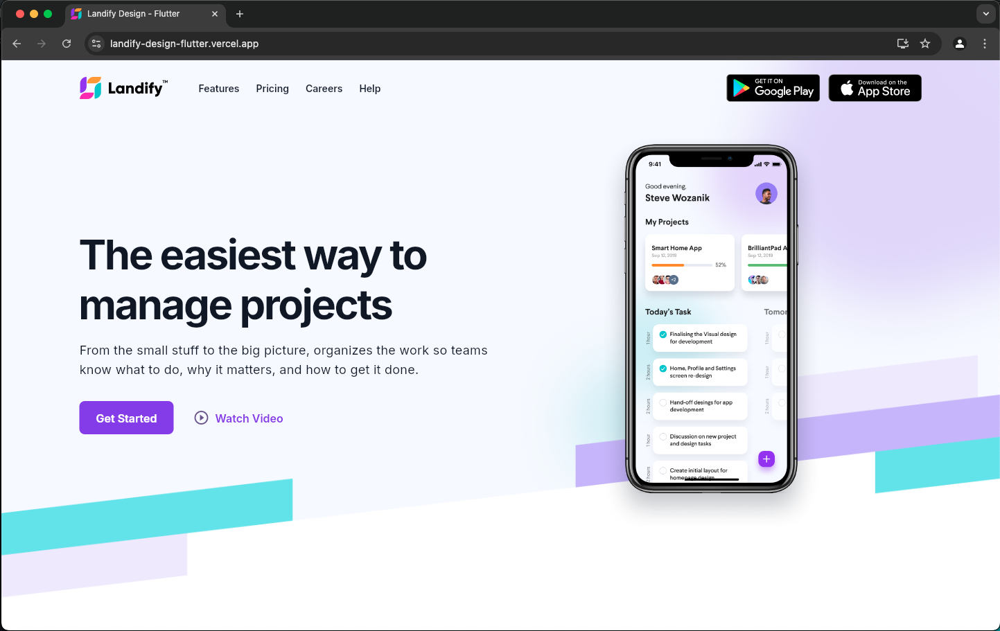
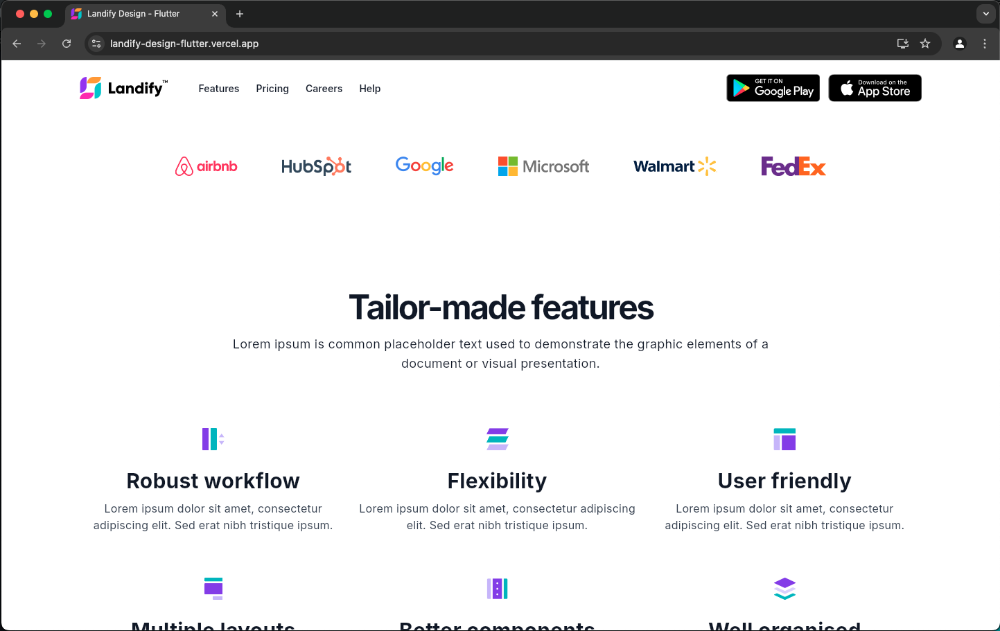
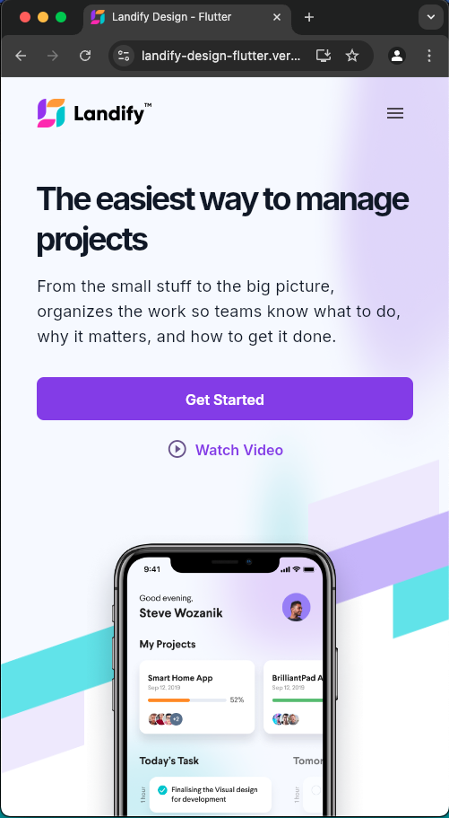
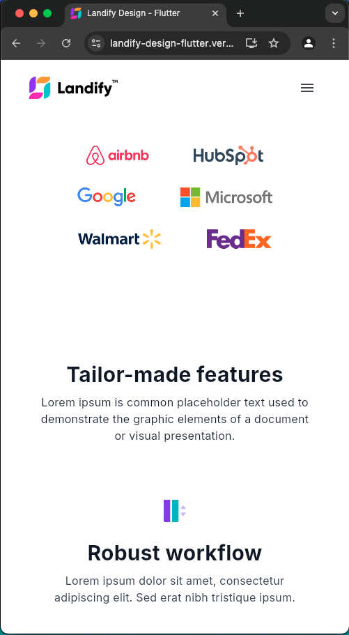

# Landify Design - Flutter Web Implementation

This project is a Flutter web implementation of the Landify Landing Page UI Kit. The UI design was provided by the Figma community and has been converted into a functional web application using Flutter.

> **Note:** This is my learning project to explore website development and Flutter.

## 🌐 Live Demo

You can access the live demo [here](https://landify-design-flutter.vercel.app).

## 🎥 Responsive Demo

Below is a GIF demonstrating the responsive design of the Landify Landing Page, built with Flutter. The site seamlessly adapts to different screen sizes, ensuring a smooth and consistent user experience across desktop, tablet, and mobile devices.

This showcases the flexibility and power of Flutter web in creating adaptive web applications.

## 🎨 Design Reference

This project is based on the [Landify - Landing Page UI Kit v2](<https://www.figma.com/design/088L8rIAnc29ArpVGDNG5y/Landify---Landing-Page-UI-Kit-v2-(Community)?node-id=1973-6598&t=KM6f0RjBK3Yq0WT8-0>) from Figma Community.

## 📸 Screenshots

### Desktop Version

### Mobile Version

  
  

## ✨ Acknowledgments

- Thanks to the Figma community for providing the Landify UI Kit.

---

## 📝 License

This project is licensed under the MIT License. You are free to use, modify, and distribute this project, as long as the original copyright notice and this permission notice appear in all copies or substantial portions of the software.
