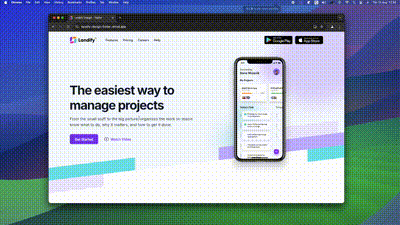

# Landify Design - Flutter Web Implementation

This project is a Flutter web implementation of the Landify Landing Page UI Kit. The UI design was provided by the Figma community and has been converted into a functional web application using Flutter.

> **Note:** This is my learning project to explore website development and Flutter.

## 🌐 Live Demo

You can access the live demo [here](https://landify-design-flutter.vercel.app).

## 🎨 Design Reference

This project is based on the [Landify - Landing Page UI Kit v2](<https://www.figma.com/design/088L8rIAnc29ArpVGDNG5y/Landify---Landing-Page-UI-Kit-v2-(Community)?node-id=1973-6598&t=KM6f0RjBK3Yq0WT8-0>) from Figma Community.

## 🎥 Responsive Demo

Below is a Video demonstrating the responsive design of the Landify Landing Page, built with Flutter. The site seamlessly adapts to different screen sizes, ensuring a smooth and consistent user experience across desktop, tablet, and mobile devices.

This showcases the flexibility and power of Flutter web in creating adaptive web applications.

## 📸 Screenshots

### Desktop Version

### Mobile Version

  
  

Here's the updated text with the `Breakpoint Utility` and `ResponsiveRowColumn` sections grouped together under a single section:

---

## 📁 Responsive Design Utilities

The project includes two important classes, `Breakpoints` and `ResponsiveRowColumn`, which are essential for creating a responsive design.

### Breakpoints

The `breakpoint.dart` file contains a custom class designed to define breakpoints for different device sizes, including mobile, tablet, laptop, and desktop. This class is inspired by the [responsive_framework](https://pub.dev/packages/responsive_framework) library but has been tailored to suit specific needs.

#### Purpose

The goal of creating this custom breakpoint class is to:

- **Customize Breakpoints**: Adjust the design to fit specific requirements and preferences.
- **Reduce Rebuilds**: Minimize unnecessary rebuilds by avoiding the use of additional variables like screen width or height.

### ResponsiveRowColumn

The `ResponsiveRowColumn` class is copied from the `responsive_framework` package. It is used to switch easily between a row and a column layout depending on the screen size, enhancing the responsive design capabilities.

---

## ✨ Acknowledgments

Thanks to the Figma community for providing the Landify UI Kit.

---

## 📝 License

This project is licensed under the MIT License. You are free to use, modify, and distribute this project, as long as the original copyright notice and this permission notice appear in all copies or substantial portions of the software.
